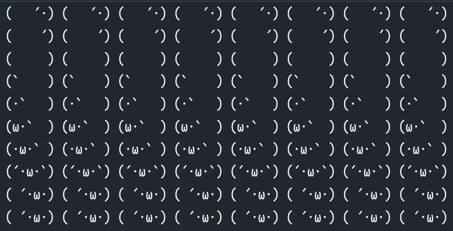

# Terminal Moji Barber ( ´･ω･)



## Quick Start

You need to have `Go` installed.

Installation:
```shell
go install github.com/guiyuanju/mojibarber@latest
```

Run in terminal:
```shell
mojibarber
```
